# 🏗️ Arquitectura y Funcionalidades - Friends & Family App

## 📊 Diagrama General del Sistema

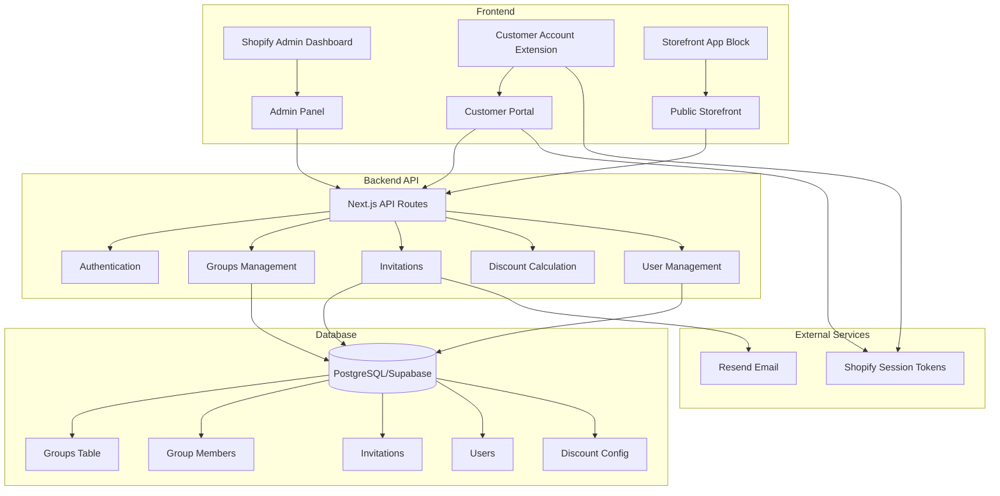

## 🔄 Flujos Principales

### 1. Flujo de Creación de Grupo

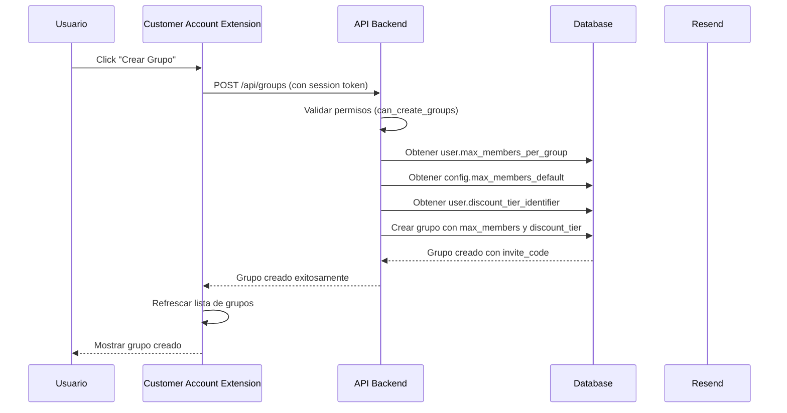

### 2. Flujo de Invitación

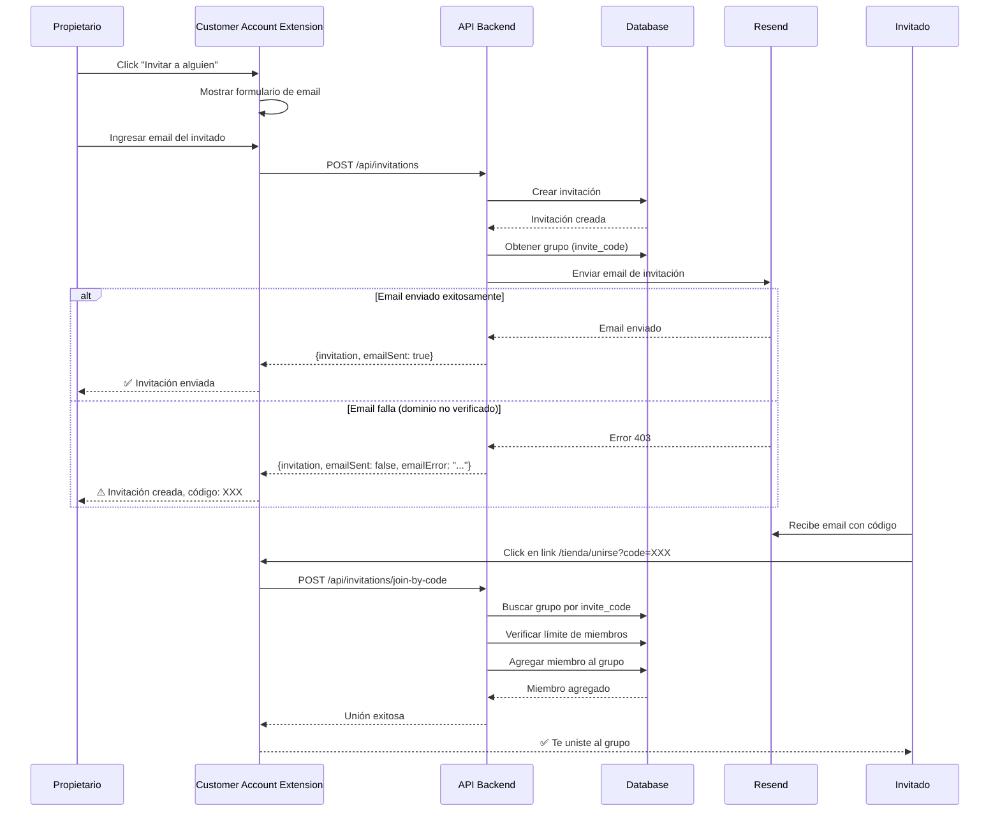

### 3. Flujo de Autenticación

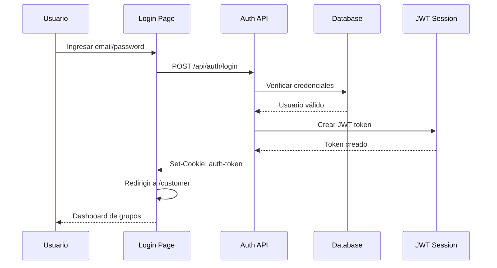

### 4. Flujo de Cálculo de Descuento

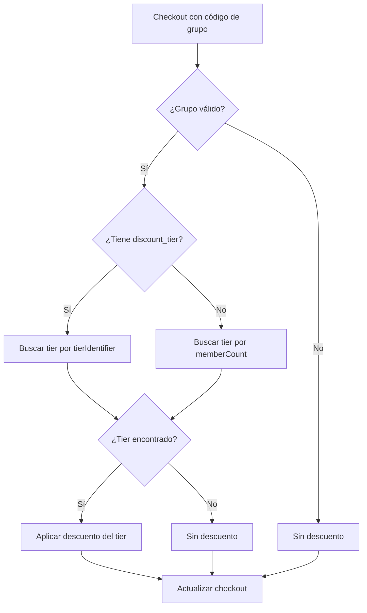

## 🎯 Funcionalidades por Módulo

### Admin Dashboard

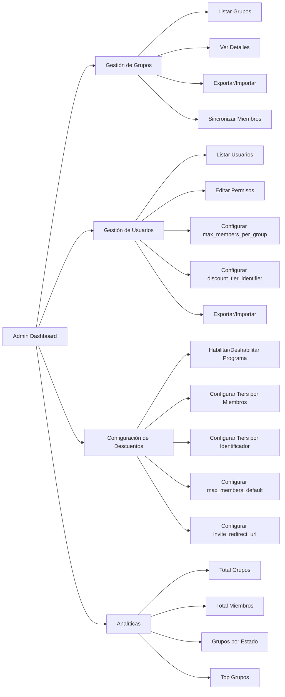

### Customer Account Extension

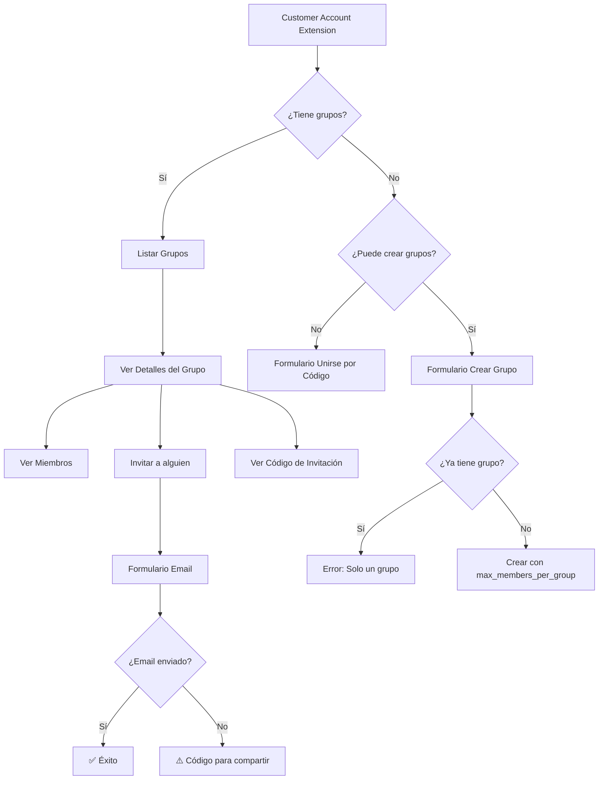

### Storefront (Público)

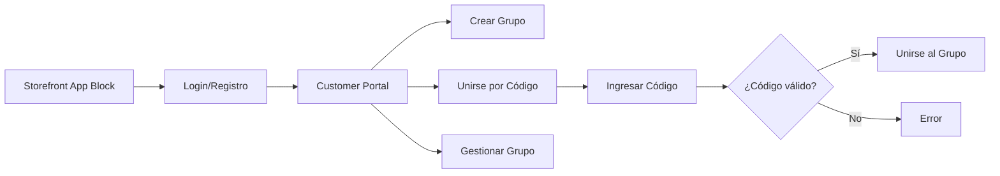

## 🗄️ Estructura de Base de Datos

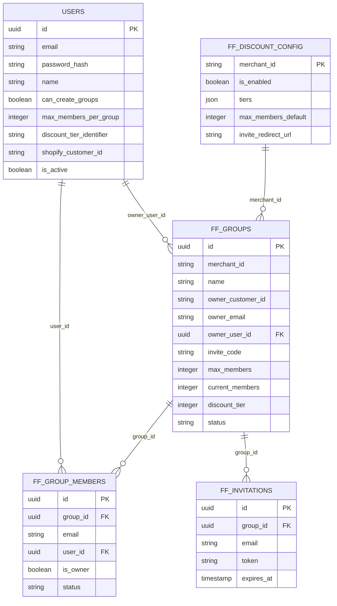

## 🔐 Sistema de Permisos

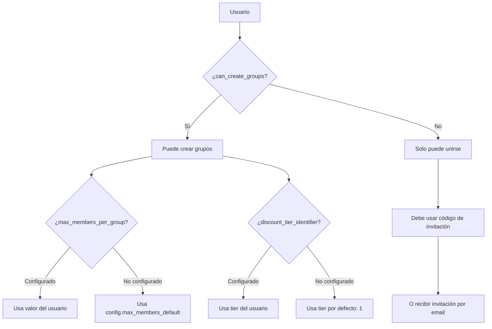

## 📧 Sistema de Emails

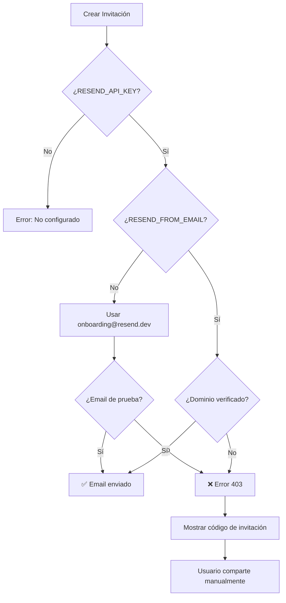

## 🎨 Componentes UI

### Admin Dashboard Components

```
AdminDashboard
├── QuickAccessCards
│   ├── GroupsCard
│   ├── UsersCard
│   ├── ConfigCard
│   └── AnalyticsCard
├── GroupsManagementPage
│   ├── GroupsList
│   ├── GroupDetails
│   ├── ExportButton
│   └── ImportModal
├── UsersManagementPage
│   ├── UsersList
│   ├── UserCard
│   │   ├── PermissionsToggle
│   │   └── GroupSettings
│   ├── ExportButton
│   └── ImportModal
├── DiscountConfigPage
│   ├── EnableToggle
│   ├── TiersList
│   │   ├── TierByMemberCount
│   │   └── TierByIdentifier
│   └── SaveButton
└── AnalyticsPage
    ├── StatsCards
    ├── GroupsByStatus
    └── TopGroups
```

### Customer Account Extension Components

```
ProfileBlock
├── GroupsList
│   └── GroupCard
│       ├── GroupInfo
│       └── ViewDetailsButton
├── GroupDetailsView
│   ├── GroupInfo
│   ├── MembersList
│   ├── InviteButton
│   └── InviteForm
│       ├── EmailInput
│       ├── SendButton
│       └── ErrorBanner
└── CreateGroupForm
    ├── NameInput
    └── CreateButton
```

## 🔄 Estados y Validaciones

### Validaciones de Grupo

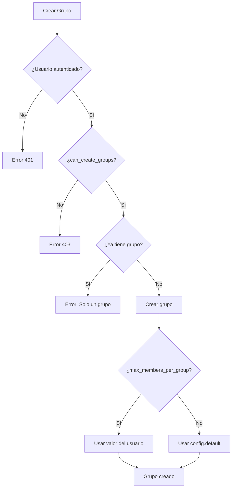

### Validaciones de Invitación

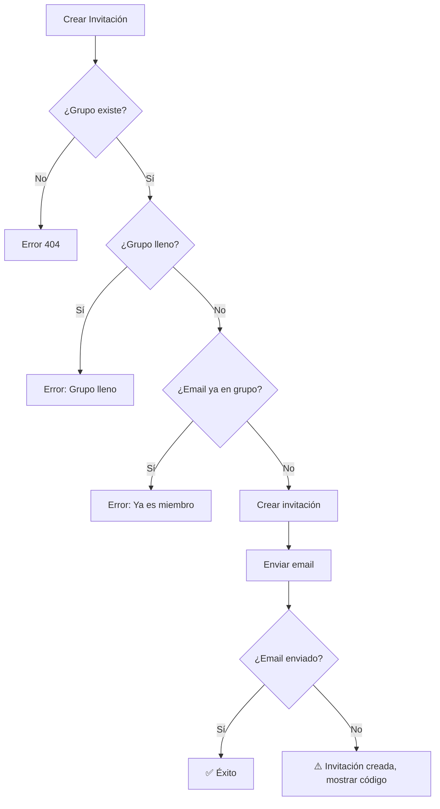

## 🌐 Integraciones

### Shopify Integration

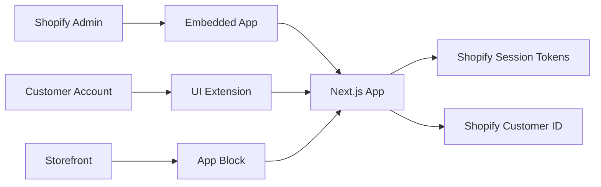

### Email Integration (Resend)

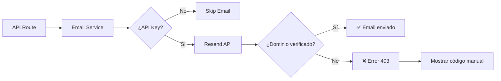

## 📱 Flujos de Usuario Completos

### Usuario Nuevo (Sin Permisos)

```
1. Registro/Login
2. Ver mensaje: "No puedes crear grupos"
3. Recibir invitación por email
4. Click en link con código
5. Unirse al grupo automáticamente
6. Ver grupo en su perfil
```

### Usuario con Permisos

```
1. Registro/Login
2. Ver opción "Crear Grupo"
3. Crear grupo (max_members automático)
4. Ver detalles del grupo
5. Invitar miembros por email
6. Si email falla, compartir código manualmente
7. Gestionar miembros del grupo
```

### Administrador

```
1. Login en Shopify Admin
2. Acceder a Friends & Family App
3. Ver Dashboard con métricas
4. Gestionar usuarios y permisos
5. Configurar descuentos y tiers
6. Ver analíticas
7. Exportar/Importar datos
```

## 🎯 Características Clave

### 1. Sistema de Descuentos Flexible

- **Tiers por Número de Miembros**: Descuentos basados en el tamaño del grupo
- **Tiers por Identificador**: Descuentos basados en `discount_tier_identifier` del usuario
- **Prioridad**: Si el grupo tiene `discount_tier`, busca por identificador primero, luego por número de miembros

### 2. Control de Permisos Granular

- `can_create_groups`: Controla si el usuario puede crear grupos
- `max_members_per_group`: Límite personalizado por usuario
- `discount_tier_identifier`: Tier de descuento asignado al usuario

### 3. Gestión de Invitaciones

- Invitaciones por email (si el dominio está verificado)
- Códigos de invitación para compartir manualmente
- Links pre-rellenados con código
- Validación de límites y duplicados

### 4. Sincronización de Datos

- Sincronización automática de `current_members`
- Botón manual de sincronización en admin
- Exportación/Importación de grupos y usuarios

## 🔒 Seguridad

- JWT tokens para autenticación web
- Shopify Session Tokens para Customer Account Extensions
- Validación de permisos en cada endpoint
- Protección de rutas con middleware
- Validación de límites de grupos y miembros

## 📊 Métricas y Analíticas

- Total de grupos
- Total de miembros
- Tamaño promedio de grupos
- Grupos por estado (activo, inactivo, suspendido, terminado)
- Top grupos por cantidad de miembros

---

**Última actualización**: 2025-11-06  
**Versión**: 1.0.0

